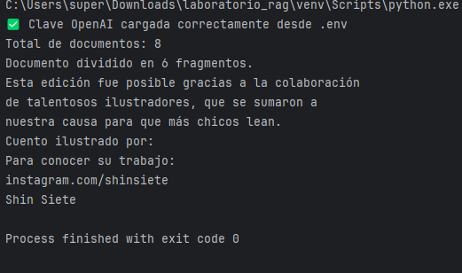
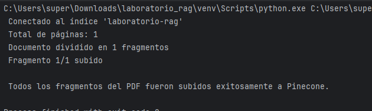
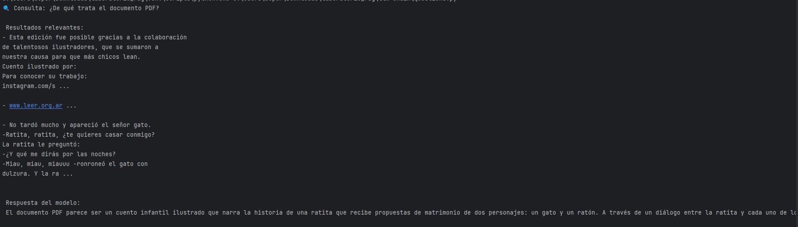
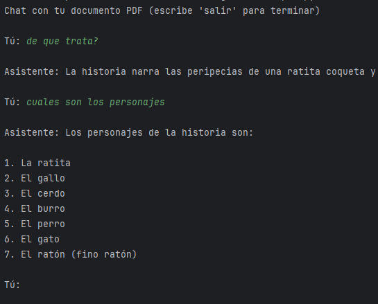

# 🧠 Laboratorio RAG con OpenAI y Pinecone

Este proyecto implementa un sistema **RAG (Retrieval-Augmented Generation)** que permite **consultar documentos PDF** utilizando **embeddings** generados por **OpenAI** y almacenados en **Pinecone**.  
Permite cargar el contenido de un PDF en una base vectorial y luego hacer preguntas por consola para obtener respuestas contextuales.

---

## 🚀 Requisitos previos

1. **Python 3.9+**
2. **Cuenta en [OpenAI](https://platform.openai.com/)**
3. **Cuenta en [Pinecone](https://www.pinecone.io/)**

---

## 📦 Instalación

1. Clona este repositorio o copia los archivos a tu entorno local:

   ```bash
   git clone https://github.com/Santiago12323/ragArep.git
   cd laboratorio_rag
    ``` 
   
2. Crea y activa un entorno virtual:

      ```bash
        python -m venv venv
        venv\Scripts\activate    # En Windows
        source venv/bin/activate # En Linux o Mac   
    ``` 

3. Instala las dependencias necesarias:
    
    ```bash
      pip install openai pinecone-client python-dotenv langchain_community langchain-text-splitters pypdf
    ``` 

## Configuración

cargar un .env con las claves 


 ```bash
      OPENAI_API_KEY=sk-...
      PINECONE_API_KEY=...
   ``` 

## partes del laboratorio

##  1. Cargar el PDF a Pinecone

### Este script:

- Carga data/documento.pdf

- Lo divide en fragmentos de texto

- Genera embeddings con text-embedding-3-small

- Los almacena en tu índice de Pinecone

### prueba: 






### 3. prueba de preguntas al modelo



### prueba: 

Respuesta del modelo:
 El documento PDF parece ser un cuento infantil ilustrado que narra la historia de una ratita que recibe propuestas de matrimonio de dos personajes: un gato y un ratón. A través de un diálogo entre la ratita y cada uno de los postulantes, la ratita evalúa sus cualidades y finalmente decide casarse con el ratón, quien le promete que se callará y soñará con ella. Además, se menciona que el cuento fue posible gracias a la colaboración de ilustradores, y se proporciona información sobre uno de ellos, Shin Siete, y un sitio web relacionado con la promoción de la lectura entre los niños.

### 4. chat por consola 




##  Tecnologías usadas

OpenAI → Generación de embeddings y respuestas.

Pinecone → Base vectorial para almacenar y recuperar fragmentos relevantes.

LangChain → Procesamiento de PDFs y división de texto.

Python dotenv → Manejo seguro de claves de entorno.

## 🧑‍💻 Autor

Santiago Coronado
Proyecto de integración RAG con OpenAI y Pinecone.